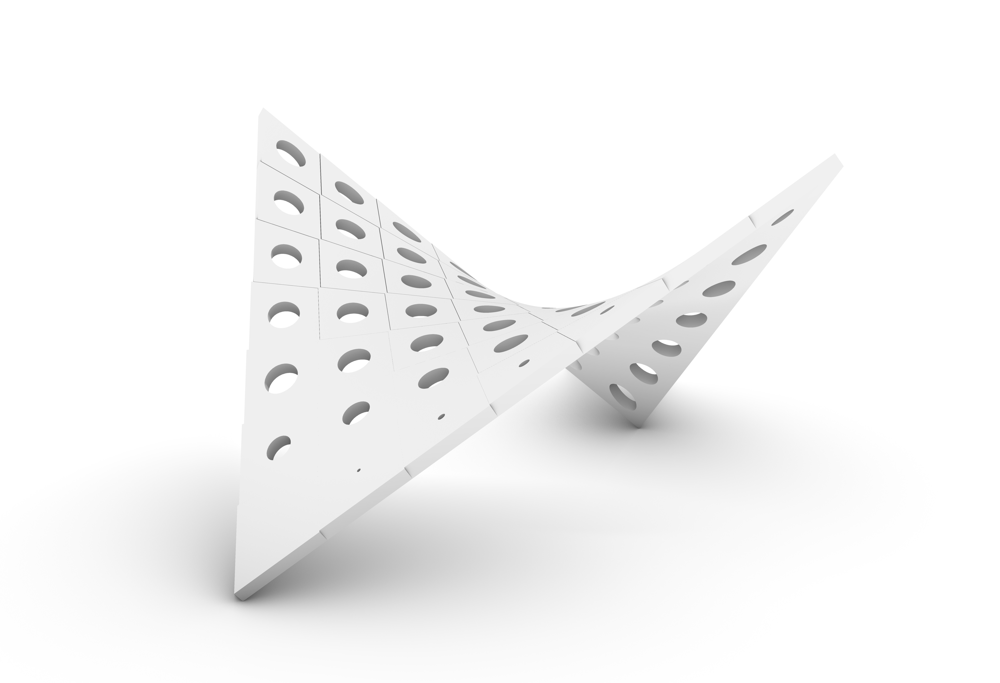

# Panel-Based Hypar

## Summary
Hyperbolic paraboloid (diamond saddle roof) structure composed of square panels.
Optional: Skylights with adjustable size based on remote point. 
Adjustable parameters include: 

The location of four points of the hypar on the ground, defining its overall shape.
Size of the panels.
Circular skylights on the panels (size and location)

## Usage
Open .ghx file in Rhino 8, via Grasshopper in command line
View >> remote control panel to view inputs. 

## Description of Procedure
(to be expanded) 
1) Set four points 
2) Draw lines from one point to form the diamond 
3) Midpoints connect, loft
4) Subdivide the loft
5) Extrude on plane 
6) Add circles (optional)

## Log

### 20/09/2024
First upload.

